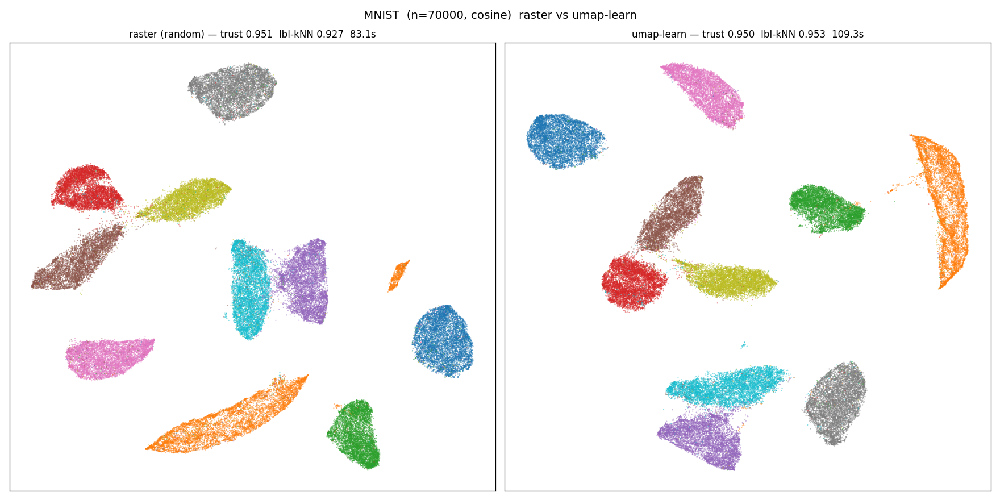
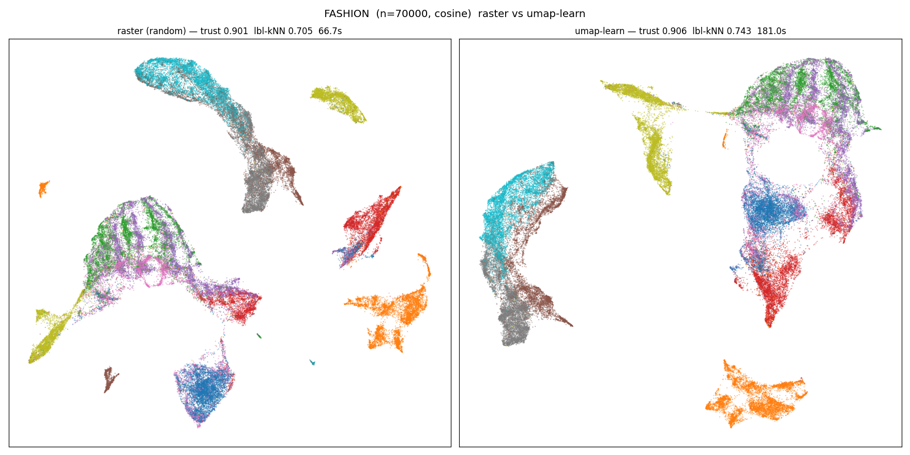

# umap-rstr

[](https://clojars.org/org.replikativ/umap-rstr)
[](https://circleci.com/gh/replikativ/umap-rstr)
[](https://clojurians.slack.com/archives/C09622F337D)

UMAP (Uniform Manifold Approximation and Projection) for Clojure, built on
[raster](https://github.com/replikativ/raster) — typed multiple dispatch with
devirtualizing bytecode compilation. The `-rstr` suffix in the repo/artifact name
(`umap-rstr`) marks the raster substrate, à la Julia's `.jl` repo suffix; the
namespace you require is just `umap`.

A faithful port of `umap-learn` (Python+numba is the gold standard): cosine/
euclidean kNN → fuzzy simplicial set → spectral/random init → negative-sampled
SGD layout. The numeric kernels are `deftm` functions that JIT-compile to
primitive-speed JVM bytecode; the orchestration is plain Clojure.

## Status

Validated against `umap-learn` on MNIST-70k and Fashion-MNIST-70k (cosine):

| dataset | trust (rstr) | trust (umap-learn) | fit (rstr) | fit (umap-learn) |
|---------|--------------|--------------------|------------|------------------|
| MNIST-70k   | 0.951 | 0.950 | 83 s  | 109 s |
| Fashion-70k | 0.901 | 0.906 | 67 s  | 181 s |

Trustworthiness matches; wall-clock is faster (incl. cold JVM/JIT). See
`dev/` for the reproducible comparison harness.

Embeddings side-by-side (left: umap-rstr, right: umap-learn), coloured by the
true class label:





## Installation

raster depends on a typedclojure fork via git, and git deps resolve transitively
only through `deps.edn` (not a Maven POM), so pin this lib as a git dependency:

```clojure
io.github.replikativ/umap-rstr
{:git/url "https://github.com/replikativ/umap-rstr"
 :git/sha "<sha>"}
```

(Once typedclojure ships its fixes in a Maven release upstream, this moves to a
`org.replikativ/umap-rstr {:mvn/version "..."}` Clojars coordinate.)

## Usage

```clojure
(require '[umap :as umap])

;; X: flat row-major double[] (or float[]) of n*dim
(def result (umap/fit X n dim :k 15 :metric :cosine :init :auto :seed 42))
(:emb result)   ;; => double[n*2] embedding
```

Options: `:k` (neighbors, 15), `:out-dim` (2), `:n-epochs` (auto 500/200),
`:neg-rate` (5.0), `:gamma` (1.0), `:init` (`:auto`/`:spectral`/`:random`),
`:metric` (`:cosine`/`:euclidean`), `:seed` (42).

## Namespaces

- `umap` — public `fit` orchestrator
- `umap.layout` — negative-sampled SGD (the hot kernel)
- `umap.graph` — fuzzy simplicial set (smooth-knn-dist, membership, symmetrize)
- `umap.spectral` — spectral init (matrix-free Lanczos, disconnected-graph handling)

kNN / RP-trees / Tausworthe RNG live in raster (`raster.knn`,
`raster.spatial.*`, `raster.tausworthe`) since they're shared with clustering.

## Requirements

Runs on the Valhalla JDK (raster's `deftm` kernels use preview features). See
raster's README for JDK setup and run with the `:valhalla` alias.

```bash
clojure -M:valhalla:test          # run tests
```

## License

BSD 3-Clause (see `LICENSE` and `NOTICE`).

umap-rstr is a derivative work — a Clojure / raster port of
[umap-learn](https://github.com/lmcinnes/umap) (© 2017 Leland McInnes, BSD
3-Clause). It follows umap-learn's algorithm and numerical behaviour but is an
independent reimplementation, not endorsed by or affiliated with the original
authors. The port is © 2026 Christian Weilbach, released under the same license.

> McInnes, L., Healy, J., & Melville, J. (2018). UMAP: Uniform Manifold
> Approximation and Projection for Dimension Reduction. arXiv:1802.03426.
